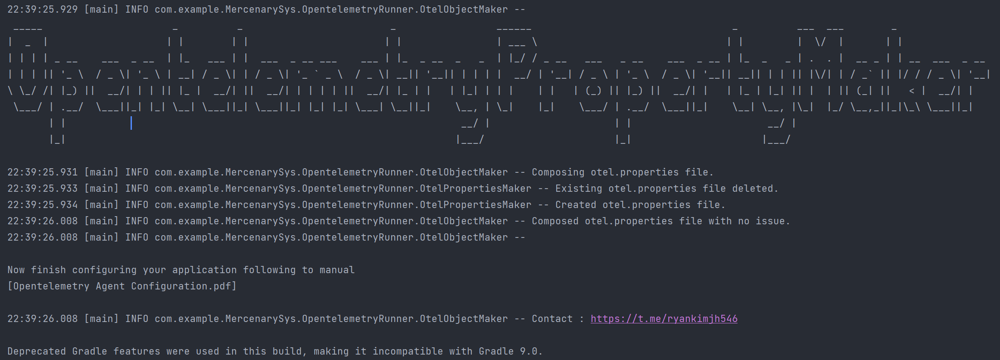

# Opentelemetry-java-property-maker

run this application where your main method place.

Opentelemetry-java-property-maker creates a file called `otel.properties`, including the required values for setting the **otel agent**. The main function is to extract data for monitoring **trace data** using Tempo, Zipkin, and Jaeger.

In order to get a Dcloser look at the trace data, the otel agent must recognize all classes and methods running in this application. Opentelemetry-java-property-maker helps you observe trace data by collecting classes and methods at high speed and raw.

